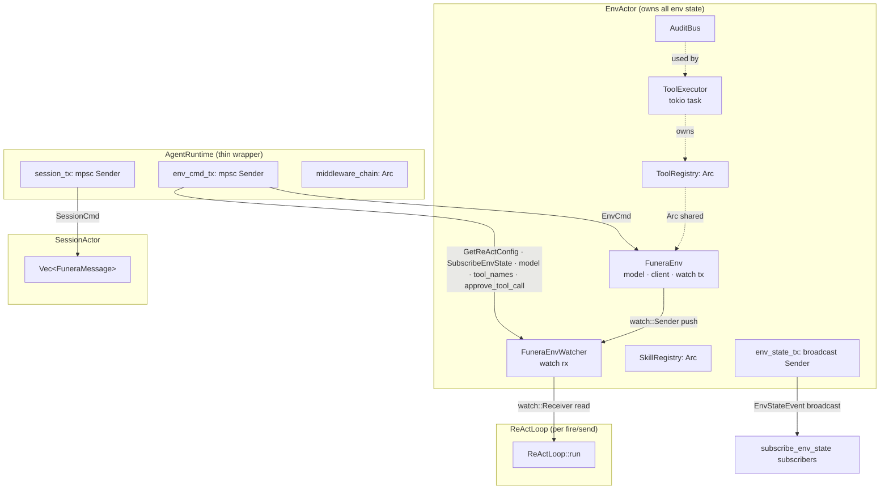
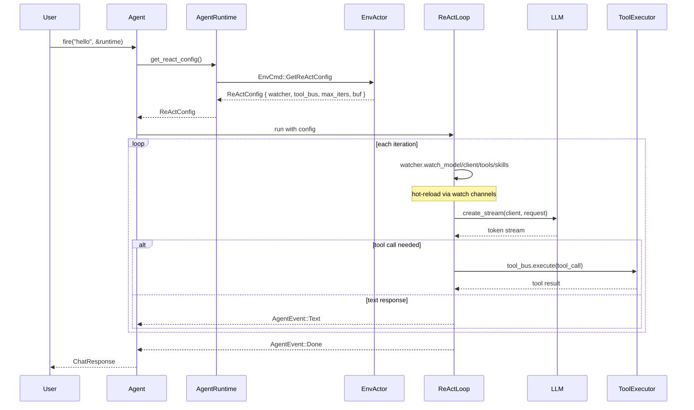
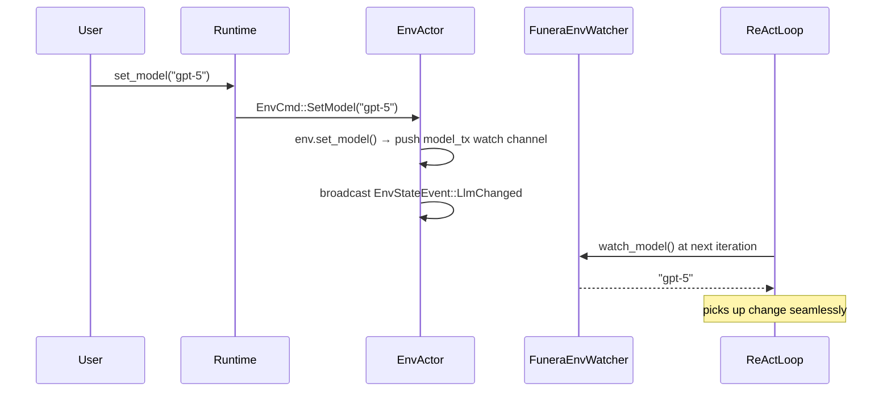

# Funera

An LLM agent framework for Rust. Build AI agents with tools, skills, middleware, and pluggable
LLM backends — all with multi-layered security and a flexible pipeline.

WARNING: This crate is still under development, the documentation may be incomplete or wrong. And the API may change.
WARNING: The security features are still under development and testing, and cannot be trusted to be secure.

[](https://opensource.org/licenses/MIT)
[](https://rust-lang.org)

## Architecture

### Crate Layers

```
┌──────────────────────────────────────────────────────────────┐
│  funera-orchestrate    high-level builder API                │
│  Agent · AgentRuntime · callbacks · streaming                │
├──────────────────────────────────────────────────────────────┤
│  funera_core           core engine                           │
│  FuneraEnv · EnvActor · ReActLoop · SessionActor · EventBus │
│  Middleware · Security · Provider · Tools · Skills           │
├──────────────────────────────────────────────────────────────┤
│  funera_builtin_tools  default tool implementations          │
│  ReadTool · WriteTool · EditTool · ShellTool                 │
└──────────────────────────────────────────────────────────────┘
```

### Runtime Communication Flow



### ReAct Loop Data Flow



### Env Hot-Reload Flow



## Features

- **ReAct loop** — iterative tool-calling agent execution with configurable max iterations and runtime hot-reloading
- **Actor-based architecture** — all mutable state lives in background tasks (EnvActor, SessionActor, ToolExecutor); `AgentRuntime` is a thin channel-wrapper
- **Pluggable providers** — OpenAI and DeepSeek backends with streaming support
- **Tool system** — define custom tools by implementing the `Tool` trait; built-in file I/O and shell
- **Skill system** — load prompt templates from YAML-frontmatter Markdown files
- **Middleware pipeline** — intercept agent events with inspectors (read-only, parallel) and mutators (pass/modify/block, sequential)
- **Security layer** — tool/shell policies, path allowlisting, audit logging, secure API key storage
- **Type-state session** — compile-time enforcement of session ownership (`Idle` / `Acquired`)

## Installation

Add the root crate to your `Cargo.toml`:

```toml
[dependencies]
funera = { git = "https://github.com/dynamder/funera" }
```

### Features

| Feature | Default | Description |
|---------|:-------:|-------------|
| `funera-builtin-tools` | ❌ | Bundled Read, Write, Edit, Shell tools |
| `tool` | ✅ | Tool system (trait, registry, executor) |
| `deepseek` | ✅ | DeepSeek provider |
| `openai` | ❌ | OpenAI provider |
| `security` | ❌ | Tool policy enforcement, path guards, audit logging |
| `sandbox` | ❌ | Kernel-level subprocess isolation (Landlock/Seatbelt/Token) |
| `middleware` | ❌ | Event interception pipeline |
| `skill` | ❌ | Skill loading and prompt injection |

## Quick Start

### One-shot query

```rust
use funera::{Agent, AgentRuntime, DeepSeekProvider};

#[tokio::main]
async fn main() -> Result<(), Box<dyn std::error::Error>> {
    let runtime = AgentRuntime::<DeepSeekProvider>::builder()
        .api_key(std::env::var("DEEPSEEK_API_KEY")?)
        .model("deepseek-v4-flash")
        .build()?;

    let agent = Agent::builder()
        .system_prompt("You are a helpful assistant.")
        .build();

    let resp = agent.fire("Hello!", &runtime).await?;
    println!("{}", resp.content);
    Ok(())
}
```

### Streaming with callbacks

```rust
use funera::{Agent, AgentEvent, AgentRuntime, DeepSeekProvider};

#[tokio::main]
async fn main() -> Result<(), Box<dyn std::error::Error>> {
    let runtime = AgentRuntime::<DeepSeekProvider>::builder()
        .api_key(std::env::var("DEEPSEEK_API_KEY")?)
        .model("deepseek-v4-flash")
        .build()?;

    let agent = Agent::builder()
        .on_token(|t| print!("{t}"))
        .build();

    let mut rx = agent.fire_stream("Explain Rust ownership", &runtime).await?;
    while let Some(event) = rx.recv().await {
        if let AgentEvent::Text(t) = event {
            print!("{t}");
        }
    }
    Ok(())
}
```

### Multi-turn conversation

```rust
let runtime = AgentRuntime::<DeepSeekProvider>::builder()
    .api_key(std::env::var("DEEPSEEK_API_KEY")?)
    .model("deepseek-v4-flash")
    .build()?;

let agent = Agent::builder()
    .system_prompt("You are helpful.")
    .build();

let handle = agent.send("Hi, I'm Alice.", runtime).await?;
let (runtime, _resp) = handle.await?;
let handle = agent.send("What's my name?", runtime).await?;
let (_runtime, _resp) = handle.await?;
```

### Runtime hot-reload

```rust
let runtime = AgentRuntime::<DeepSeekProvider>::builder()
    .api_key(std::env::var("DEEPSEEK_API_KEY")?)
    .model("deepseek-v4-flash")
    .build()?;

// Switch model mid-conversation — picked up on next ReAct iteration
runtime.set_model("deepseek-r1");

// Dynamically add a tool
runtime.add_tool(Box::new(MyTool));

// Subscribe to env state changes
let mut env_rx = runtime.subscribe_env_state().await;
```

### Custom tool

```rust
use async_trait::async_trait;
use funera::core::re_act::tool::{Tool, ToolCallError};
use serde_json::{json, Value as JsonValue};

struct Calculator;

#[async_trait]
impl Tool for Calculator {
    fn name(&self) -> &str { "calculator" }
    fn description(&self) -> &str { "Evaluate a math expression" }
    fn schema(&self) -> JsonValue {
        json!({
            "type": "function",
            "function": {
                "name": "calculator",
                "parameters": {
                    "type": "object",
                    "properties": {
                        "expression": { "type": "string" }
                    },
                    "required": ["expression"]
                }
            }
        })
    }
    async fn execute(&self, args: JsonValue) -> Result<String, ToolCallError> {
        let expr = args["expression"].as_str().unwrap_or("");
        Ok(format!("TODO: compute {expr}"))
    }
}

// Register it:
let runtime = AgentRuntime::<DeepSeekProvider>::builder()
    .api_key(std::env::var("DEEPSEEK_API_KEY")?)
    .model("deepseek-v4-flash")
    .with_tool_instance(Box::new(Calculator))
    .build()?;
```

### Security configuration

Requires the `security` feature (and optionally `funera-builtin-tools`, `sandbox`):

```rust
use funera::{Agent, AgentRuntime, DeepSeekProvider, ToolPolicy, ShellPolicy};

#[tokio::main]
async fn main() -> Result<(), Box<dyn std::error::Error>> {
    let runtime = AgentRuntime::<DeepSeekProvider>::builder()
        .api_key(std::env::var("DEEPSEEK_API_KEY")?)
        .model("deepseek-v4-flash")
        .with_builtin_tools()
        .with_tool_policy(ToolPolicy {
            denied_tools: ["shell".into()].into_iter().collect(),
            shell_policy: Some(ShellPolicy::with_allowed(
                vec!["git".into(), "cargo".into()],
            )),
            ..Default::default()
        })
        .build()?;

    let agent = Agent::builder().build();
    let resp = agent.fire("List the git log.", &runtime).await?;
    println!("{}", resp.content);
    Ok(())
}
```

## Project structure

```
funera/
├── funera_core/          Core agent engine
│   └── src/
│       ├── chat/         Message types, session actor
│       ├── env.rs        Runtime environment + watch hot-reload
│       ├── env_actor.rs  EnvActor — single source of truth for all env state
│       ├── event_bus/    Token, React, EnvState, Tool buses
│       ├── middleware.rs  Event interception pipeline
│       ├── provider/     OpenAI & DeepSeek backends
│       ├── re_act/       ReAct loop, Tool trait, Skill system
│       └── security/     Policies, path guard, audit, secrets
├── funera-orchestrate/   High-level builder API
│   ├── src/
│   │   ├── agent.rs      Agent & AgentBuilder
│   │   ├── runtime.rs    AgentRuntime & AgentRuntimeBuilder
│   │   ├── event.rs      AgentEvent enum
│   │   ├── dispatcher.rs  Callback dispatch
│   │   └── send_handle.rs Ownership handles
│   └── examples/         Example programs
├── funera_builtin_tools/  Default tool implementations
│   └── src/
│       ├── read.rs       ReadTool (file/dir, hashline output)
│       ├── write.rs      WriteTool (auto parent dirs)
│       ├── edit.rs       EditTool (hashline-anchored editing)
│       └── shell.rs      ShellTool (cross-platform, timeout)
```

## License

MIT — see the [repository](https://github.com/dynamder/Funera) for details.
