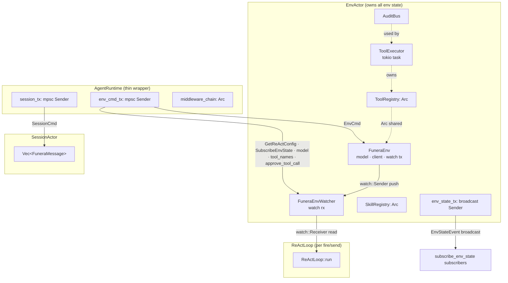
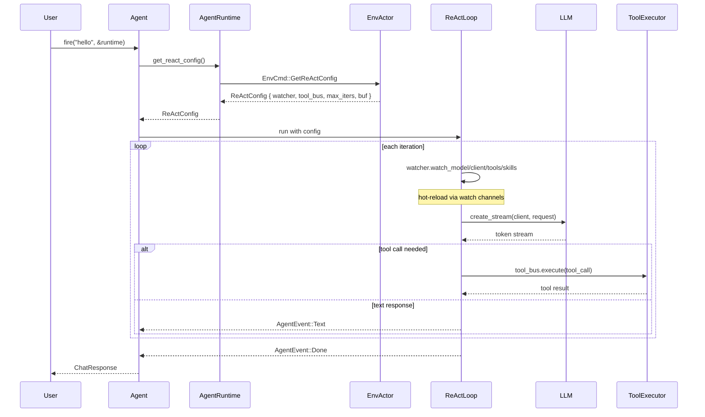
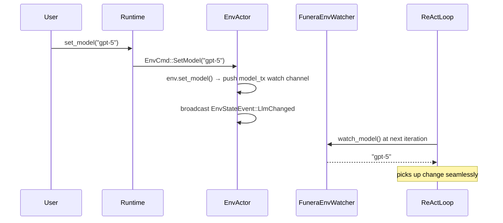

# Funera

> A security-oriented Rust LLM agent framework — ReAct loop, tools, skills, middleware, and
> pluggable LLM backends, with reversible effects that make teardown leak-free by construction.

WARNING: This crate is still under development, the documentation may be incomplete or wrong. And the API may change.
WARNING: The security features are still under development and testing, and cannot be trusted to be secure.

[](https://github.com/dynamder/funera/actions/workflows/ci.yml)
[](https://crates.io/crates/funera)
[](https://docs.rs/funera)
[](https://opensource.org/licenses/MIT)
[](https://github.com/dynamder/funera/blob/main/CONTRIBUTING.md#minimum-supported-rust-version-msrv)
[](https://rust-lang.org)

## Why Funera?

- **Simple core, broad extensibility** — `ChatProvider`, `Tool`, `Skill`, and middleware are
  plain Rust traits; the runtime is a thin channel wrapper around an `EnvActor` that owns all
  state.
- **Reversible effects** — `FuneraEnv::effect` pairs every registration with its inverse; a
  single `dispose()` runs all inverses in reverse (LIFO) order, so memory and services never
  leak. The `EnvActor` disposes automatically when the runtime is dropped.
- **Runtime hot-reload** — model, client, tools, and skills can change mid-conversation; the
  ReAct loop picks changes up on the next iteration.
- **Actor-based architecture** — all mutable state lives in background tasks; `AgentRuntime` is
  a thin channel wrapper.
- **Security-oriented** — tool policies, path guards, audit logging, secure key storage, and a
  kernel-backed sandbox on supported platforms.

## Quick Start

```rust
use funera::{Agent, AgentRuntime, DeepSeekProvider};

#[tokio::main]
async fn main() -> Result<(), Box<dyn std::error::Error>> {
    let runtime = AgentRuntime::<DeepSeekProvider>::builder()
        .api_key(std::env::var("DEEPSEEK_API_KEY")?)
        .model("deepseek-v4-flash")
        .build()?;

    let agent = Agent::builder()
        .system_prompt("You are a helpful assistant.")
        .build();

    let resp = agent.fire("Hello!", &runtime).await?.await?.await?;
    println!("{}", resp.content);
    Ok(())
}
```

## Architecture

### Crate Layers

```
┌──────────────────────────────────────────────────────────────┐
│  funera-orchestrate    high-level builder API                │
│  Agent · AgentRuntime · callbacks · streaming                │
├──────────────────────────────────────────────────────────────┤
│  funera_core           core engine                           │
│  FuneraEnv · EnvActor · ReActLoop · SessionActor · EventBus │
│  Middleware · Security · Provider · Tools · Skills           │
├──────────────────────────────────────────────────────────────┤
│  funera_builtin_tools  default tool implementations          │
│  ReadTool · WriteTool · EditTool · ShellTool                 │
└──────────────────────────────────────────────────────────────┘
```

### Runtime Communication Flow


```mermaid
graph TD
    subgraph "AgentRuntime (thin wrapper)"
        env_cmd_tx[env_cmd_tx: mpsc Sender]
        session_tx[session_tx: mpsc Sender]
        mw[ middleware_chain: Arc ]
    end

    subgraph "EnvActor (owns all env state)"
        env_state[FuneraEnv<br/>model · client · watch tx]
        watcher[FuneraEnvWatcher<br/>watch rx]
        registry[ToolRegistry: Arc]
        skill_reg[SkillRegistry: Arc]
        executor[ToolExecutor<br/>tokio task]
        audit[AuditBus]
        state_tx[env_state_tx: broadcast Sender]
    end

    subgraph "SessionActor"
        msgs[Vec&lt;FuneraMessage&gt;]
    end

    subgraph "ReActLoop (per fire/send)"
        loop_core[ReActLoop::run]
    end

    env_cmd_tx -->|EnvCmd| env_state
    env_cmd_tx -->|GetReActConfig · SubscribeEnvState · model · tool_names · approve_tool_call| watcher
    session_tx -->|SessionCmd| msgs

    env_state -->|watch::Sender push| watcher
    watcher -->|watch::Receiver read| loop_core

    state_tx -->|EnvStateEvent broadcast| subscribers[subscribe_env_state subscribers]

    executor -.->|owns| registry
    registry -.->|Arc shared| env_state
    audit -.->|used by| executor
```

### ReAct Loop Data Flow


```mermaid
sequenceDiagram
    participant User
    participant Agent
    participant Runtime as AgentRuntime
    participant EnvActor as EnvActor
    participant ReAct as ReActLoop
    participant LLM
    participant Tool as ToolExecutor

    User->>Agent: fire("hello", &runtime)
    Agent->>Runtime: get_react_config()
    Runtime->>EnvActor: EnvCmd::GetReActConfig
    EnvActor-->>Runtime: ReActConfig { watcher, tool_bus, max_iters, buf }
    Runtime-->>Agent: ReActConfig

    Agent->>ReAct: run with config

    loop each iteration
        ReAct->>ReAct: watcher.watch_model/client/tools/skills
        Note over ReAct: hot-reload via watch channels

        ReAct->>LLM: create_stream(client, request)
        LLM-->>ReAct: token stream

        alt tool call needed
            ReAct->>Tool: tool_bus.execute(tool_call)
            Tool-->>ReAct: tool result
        else text response
            ReAct-->>Agent: AgentEvent::Text
        end
    end

    ReAct-->>Agent: AgentEvent::Done
    Agent-->>User: ChatResponse
```

### Env Hot-Reload Flow


```mermaid
sequenceDiagram
    participant User
    participant Runtime
    participant EnvActor
    participant Watcher as FuneraEnvWatcher
    participant ReAct as ReActLoop

    User->>Runtime: set_model("gpt-5")
    Runtime->>EnvActor: EnvCmd::SetModel("gpt-5")
    EnvActor->>EnvActor: env.set_model() → push model_tx watch channel
    EnvActor->>EnvActor: broadcast EnvStateEvent::LlmChanged

    ReAct->>Watcher: watch_model() at next iteration
    Watcher-->>ReAct: "gpt-5"
    Note over ReAct: picks up change seamlessly
```

## Features

- **ReAct loop** — iterative tool-calling agent execution with configurable max iterations and runtime hot-reloading
- **Actor-based architecture** — all mutable state lives in background tasks (EnvActor, SessionActor, ToolExecutor); `AgentRuntime` is a thin channel-wrapper
- **Reversible effects** — `FuneraEnv::effect` / `dispose` run registered teardown actions in LIFO order (idempotent, panic-isolated), so registrations never leak
- **Pluggable providers** — OpenAI and DeepSeek backends with streaming support
- **Tool system** — define custom tools by implementing the `Tool` trait; built-in file I/O and shell
- **Skill system** — load prompt templates from YAML-frontmatter Markdown files
- **Middleware pipeline** — intercept agent events with inspectors (read-only, parallel) and mutators (pass/modify/block, sequential)
- **Security layer** — tool/shell policies, path allowlisting, audit logging, secure API key storage
- **Type-state session** — compile-time enforcement of session ownership (Idle / Acquired)
- **Cancellation** — every call returns a cancellable handle (ire → FireHandle, ire_stream / send / send_stream); cancel() or dropping the handle immediately stops receiving output, abandons in-flight tool executions, and notifies middleware via AgentEvent::Cancelled (never written to session history).

## Examples

| Example | Description |
|---|---|
| `minimal` | One-shot `Agent::fire` |
| `multi_turn` | Persistent multi-turn conversation |
| `streaming` / `streaming_with_tools` | Token streaming with/without tools |
| `custom_tool` | Define and register a custom tool |
| `middleware` | Inspector/Mutator middleware pipeline |
| `reversible_effects` | LIFO teardown of registered effects (no LLM) |
| `tool_policy` / `security` / `sandbox` | Security policies, audit, and sandboxing |
| `cancel` | Cancellation: explicit `cancel()`, drop-to-cancel, timeout via `select!` |

## Reversible effects

Funera guarantees leak-free teardown with a single generic primitive:

```rust,no_run
use funera_core::env::FuneraEnv;

# fn example(env: &FuneraEnv) {
env.effect(|| {
    let resource = acquire();              // setup: the effect
    Box::new(move || release(resource))    // teardown: its inverse
});
# }
# fn acquire() -> String { String::new() }
# fn release(_: String) {}
```

- `effect(body)` runs `body` now and pushes the returned disposer onto the env's accumulator.
- `dispose()` runs every disposer in **reverse registration order** (LIFO), so later effects —
  which may depend on earlier ones — are undone first.
- Disposal is **idempotent** (the accumulator is drained) and **panic-isolated** (a panicking
  disposer is caught and logged; the rest still run).
- `EnvActor` calls `dispose()` automatically once the runtime is dropped, so anything registered
  against the env is reverted — no memory or service leaks.
- Tool registrations are paired with their exact inverse internally
  (`remove_tool_if_same` removes a tool only if the registered entry is the
  *same* `Arc`, so a stale teardown never deletes a replacement that reuses
  the same name); external extensions register tools through the runtime API
  and do not reach into the tool registry themselves.

Run the demo:

```bash
cargo run -p funera-orchestrate --example reversible_effects
```

### Limitations

- `FuneraEnv::dispose` runs sync disposers in LIFO order with panic isolation. A sync disposer
  cannot be safely timed out by the runtime; keep disposers short and non-blocking. Async
  teardown can be scheduled from the disposer onto a tokio runtime and awaited by the caller if
  needed.
- `security`-featured tool execution runs outside the registry lock via a cloned guarded
  registry; the clone shares approval and react-bus state, while policy/path configuration is
  snapshotted at call time.

## Installation

Add the root crate to your `Cargo.toml`:

```toml
[dependencies]
funera = { git = "https://github.com/dynamder/funera" }
```

### Features

| Feature | Default | Description |
|---------|:-------:|-------------|
| `funera-builtin-tools` | ❌ | Bundled Read, Write, Edit, Shell tools |
| `tool` | ✅ | Tool system (trait, registry, executor) |
| `deepseek` | ✅ | DeepSeek provider |
| `openai` | ❌ | OpenAI provider |
| `security` | ❌ | Tool policy enforcement, path guards, audit logging |
| `sandbox` | ❌ | Kernel-level subprocess isolation (Landlock/Seatbelt/Token) |
| `middleware` | ❌ | Event interception pipeline |
| `skill` | ❌ | Skill loading and prompt injection |

## Quick Start

### One-shot query

```rust
use funera::{Agent, AgentRuntime, DeepSeekProvider};

#[tokio::main]
async fn main() -> Result<(), Box<dyn std::error::Error>> {
    let runtime = AgentRuntime::<DeepSeekProvider>::builder()
        .api_key(std::env::var("DEEPSEEK_API_KEY")?)
        .model("deepseek-v4-flash")
        .build()?;

    let agent = Agent::builder()
        .system_prompt("You are a helpful assistant.")
        .build();

    let resp = agent.fire("Hello!", &runtime).await?.await?.await?;
    println!("{}", resp.content);
    Ok(())
}
```

### Streaming with callbacks

```rust
use funera::{Agent, AgentEvent, AgentRuntime, DeepSeekProvider};

#[tokio::main]
async fn main() -> Result<(), Box<dyn std::error::Error>> {
    let runtime = AgentRuntime::<DeepSeekProvider>::builder()
        .api_key(std::env::var("DEEPSEEK_API_KEY")?)
        .model("deepseek-v4-flash")
        .build()?;

    let agent = Agent::builder()
        .on_token(|t| print!("{t}"))
        .build();

    let mut rx = agent.fire_stream("Explain Rust ownership", &runtime).await?;
    while let Some(event) = rx.recv().await {
        if let AgentEvent::Text(t) = event {
            print!("{t}");
        }
    }
    Ok(())
}
```

### Multi-turn conversation

```rust
let runtime = AgentRuntime::<DeepSeekProvider>::builder()
    .api_key(std::env::var("DEEPSEEK_API_KEY")?)
    .model("deepseek-v4-flash")
    .build()?;

let agent = Agent::builder()
    .system_prompt("You are helpful.")
    .build();

let handle = agent.send("Hi, I'm Alice.", runtime).await?;
let (runtime, _resp) = handle.await?;
let handle = agent.send("What's my name?", runtime).await?;
let (_runtime, _resp) = handle.await?;
```

### Runtime hot-reload

```rust
let runtime = AgentRuntime::<DeepSeekProvider>::builder()
    .api_key(std::env::var("DEEPSEEK_API_KEY")?)
    .model("deepseek-v4-flash")
    .build()?;

// Switch model mid-conversation — picked up on next ReAct iteration
runtime.set_model("deepseek-r1");

// Dynamically add a tool
runtime.add_tool(std::sync::Arc::new(MyTool));

// Subscribe to env state changes
let mut env_rx = runtime.subscribe_env_state().await;
```

### Custom tool

```rust
use async_trait::async_trait;
use funera::core::re_act::tool::{Tool, ToolCallError};
use serde_json::{json, Value as JsonValue};

struct Calculator;

#[async_trait]
impl Tool for Calculator {
    fn name(&self) -> &str { "calculator" }
    fn description(&self) -> &str { "Evaluate a math expression" }
    fn schema(&self) -> JsonValue {
        json!({
            "type": "function",
            "function": {
                "name": "calculator",
                "parameters": {
                    "type": "object",
                    "properties": {
                        "expression": { "type": "string" }
                    },
                    "required": ["expression"]
                }
            }
        })
    }
    async fn execute(&self, args: JsonValue) -> Result<String, ToolCallError> {
        let expr = args["expression"].as_str().unwrap_or("");
        Ok(format!("TODO: compute {expr}"))
    }
}

// Register it:
let runtime = AgentRuntime::<DeepSeekProvider>::builder()
    .api_key(std::env::var("DEEPSEEK_API_KEY")?)
    .model("deepseek-v4-flash")
    .with_tool_instance(std::sync::Arc::new(Calculator))
    .build()?;
```

If your tool executes shell commands, opt in explicitly via `is_shell_tool`
so the security layer's `ShellPolicy` applies — based on the marker, not on
the tool's registered name:

```rust
impl Tool for Shell {
    fn name(&self) -> &str { "shell" }
    // ...
    fn is_shell_tool(&self) -> bool { true }
}
```

### Security configuration

Requires the `security` feature (and optionally `funera-builtin-tools`, `sandbox`):

```rust
use funera::{Agent, AgentRuntime, DeepSeekProvider, ToolPolicy, ShellPolicy};

#[tokio::main]
async fn main() -> Result<(), Box<dyn std::error::Error>> {
    let runtime = AgentRuntime::<DeepSeekProvider>::builder()
        .api_key(std::env::var("DEEPSEEK_API_KEY")?)
        .model("deepseek-v4-flash")
        .with_builtin_tools()
        .with_tool_policy(ToolPolicy {
            denied_tools: ["shell".into()].into_iter().collect(),
            shell_policy: Some(ShellPolicy::with_allowed(
                vec!["git".into(), "cargo".into()],
            )),
            ..Default::default()
        })
        .build()?;

    let agent = Agent::builder().build();
    let resp = agent.fire("List the git log.", &runtime).await?.await?.await?;
    println!("{}", resp.content);
    Ok(())
}
```

## Project structure

```
funera/
├── funera_core/          Core agent engine
│   └── src/
│       ├── chat/         Message types, session actor
│       ├── env.rs        Runtime environment, watch hot-reload, reversible effects
│       ├── env_actor.rs  EnvActor — single source of truth for all env state
│       ├── event_bus/    Token, React, EnvState, Tool buses
│       ├── middleware.rs  Event interception pipeline
│       ├── provider/     OpenAI & DeepSeek backends
│       ├── re_act/       ReAct loop, Tool trait, Skill system
│       └── security/     Policies, path guard, audit, secrets
├── funera-orchestrate/   High-level builder API
│   ├── src/
│   │   ├── agent.rs      Agent & AgentBuilder
│   │   ├── runtime.rs    AgentRuntime & AgentRuntimeBuilder
│   │   ├── event.rs      AgentEvent enum
│   │   ├── dispatcher.rs  Callback dispatch
│   │   └── send_handle.rs Ownership handles
│   └── examples/         Example programs (incl. reversible_effects)
├── funera_builtin_tools/  Default tool implementations
│   └── src/
│       ├── read.rs       ReadTool (file/dir, hashline output)
│       ├── write.rs      WriteTool (auto parent dirs)
│       ├── edit.rs       EditTool (hashline-anchored editing)
│       └── shell.rs      ShellTool (cross-platform, timeout)
```

## Contributing

Contributions are welcome! Please read:

- [CONTRIBUTING.md](CONTRIBUTING.md) — build, test, and pull-request workflow
- [CODE_OF_CONDUCT.md](CODE_OF_CONDUCT.md) — community standards
- [SECURITY.md](SECURITY.md) — reporting security vulnerabilities

## License

MIT — see the [repository](https://github.com/dynamder/Funera) for details.
